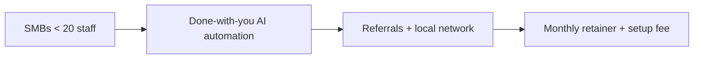
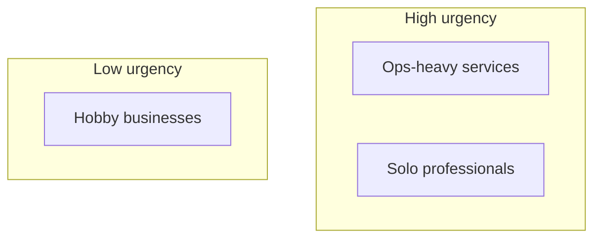
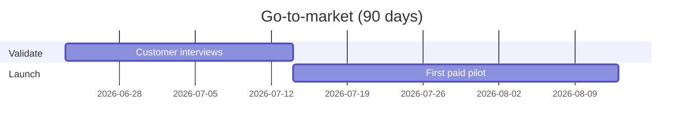
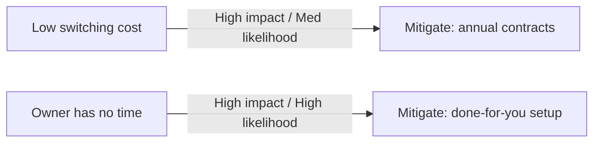
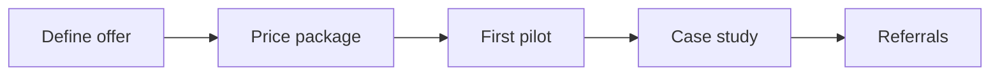

# Mermaid diagram generation

Reference for producing Obsidian-native Mermaid diagrams. The rule "use Mermaid only where
it adds clarity" lives in `CLAUDE.md` (C7); this skill is the how-to and pattern catalog.

## When to draw (and when not to)
Draw a diagram only when it makes a relationship clearer than prose or a table would.
**If a diagram would have more than ~12 nodes or crossing edges that make it unreadable,
use a Markdown table or split it into two simpler diagrams instead.** A cluttered diagram
is worse than a clean table.

Only generate the diagram types requested in the case's `config.yaml` `diagram_types`,
plus any that clearly add value.

## Format
Fenced ` ```mermaid ` blocks render natively in Obsidian. Keep node labels short. Put each
diagram in its own note under `output/diagrams/` with frontmatter and a one-line caption,
and wikilink it from the relevant section.

## Patterns

**Business model map** — flowchart linking segments → value prop → channels → revenue:



**Customer segment map** — group segments by a dimension (e.g. urgency vs ability to pay):



**Go-to-market timeline** — phases over the time horizon:



**Risk map** — likelihood × impact as a labeled grid or flow:



**Dependency graph** — what must happen before what:



## Quality rules
- Label edges with meaning where it helps (e.g. risk severity).
- Tie diagram content back to evidence where possible; do not invent nodes the evidence
  and plan do not support.
- Prefer a few clear diagrams over many noisy ones.
- If you cannot make a diagram readable, say so and provide a table instead.
