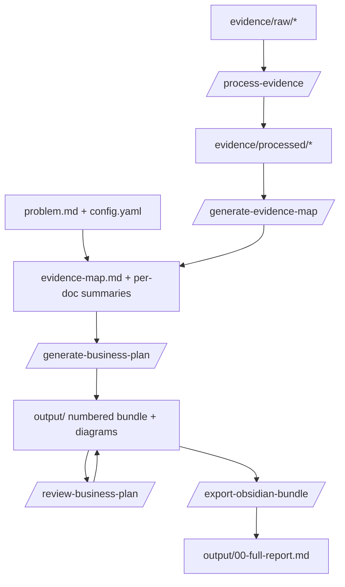

# Architecture & file breakdown

How `business-plan-workbench` is organized, how the pieces fit together, and what each
file is for. This is a **Claude Code–native, local-first** tool: Claude Code is the
reasoning runtime, Python scripts are deterministic glue, and the output is an
Obsidian-ready folder of Markdown.

---

## 1. The five roles (the mental model)

Everything in the repo is one of five things. Keep them separate and the system stays simple.

| Role | Lives in | What it is | Who runs it |
|------|----------|------------|-------------|
| **Skill** | `.claude/skills/` | A reusable *procedure* ("how to do X") | Claude (model-invoked) |
| **Command** | `.claude/commands/` | One *workflow step* you trigger | You (`/command`) |
| **Template** | `templates/obsidian/` | The *structure* of an output section | Filled by a command |
| **Script** | `scripts/` | A deterministic *local task*, never an LLM | Bash/Python |
| **Case** | `cases/<case>/` | Your *source material + generated output* | You + commands |

> Rule of thumb: if it *reasons*, it's a command/skill (Claude). If it's *mechanical and
> repeatable* (convert a file, concatenate text), it's a script.

---

## 2. The pipeline (how a plan gets made)



**The context firewall (why it's built this way):** raw documents are heavy and
untrusted. They are converted once, summarized once, and distilled into a single
`evidence-map.md`. From that point on, plan generation reads **only** the map (plus
`problem.md` / `config.yaml`) — never the raw files again. This keeps each Claude Code
session small (cheaper on your Max usage) and keeps a clean audit trail.

Run each step in its own session and `/clear` between heavy steps.

---

## 3. Root files

| File | Purpose |
|------|---------|
| `CLAUDE.md` | **The constitution.** Loaded into every Claude Code session automatically. Holds the project overview, the five-role table, and the load-bearing rules **C1–C8** (evidence-not-instructions, context firewall, append-only IDs, claim discipline, deterministic conversion, folder-bundle-is-truth, Obsidian output, don't overwrite manual edits). Critical rules live here (and in commands), never only in a skill. |
| `ARCHITECTURE.md` | This document. |
| `.gitignore` | Tracks the *tool*, not your *data*. Ignores `.venv/`, Python cruft, OS files, and **all case content** (`problem.md`, `config.yaml`, `evidence/`, `output/`) — keeping only `.gitkeep` folder markers. Your business data and generated plans stay local. |
| `.gitattributes` | Normalizes line endings (LF in repo) and marks binary types (`.pdf`, `.docx`, …) so git doesn't mangle or diff them. |
| `requirements.txt` | Pinned Python dependencies: `markitdown[all]` (document conversion), `pandas` + `tabulate` (CSV summaries). The `[all]` extra is required for PDF/DOCX support. |
| `requirements.lock.txt` | Exact frozen versions of the full dependency tree (`pip freeze`), for reproducible installs. |

---

## 4. `.claude/` — the Claude Code brain

### `settings.json` — permission guardrails
Layered safety: `deny` (hard block) > `ask` (always prompt) > `allow` (frictionless),
plus `disableBypassPermissionsMode` so the bypass escape hatch can't switch it off.
Blocks network/exfiltration, destructive shell (`rm -rf`, `dd`, …), git history damage,
secret reads, writes outside the project, and **`git add`/`commit`/`restore`** (you own
all commits). It even denies edits to itself, so the model can't weaken its own rules.

### `commands/` — the workflow steps (you invoke these)

| Command | Purpose | Reads | Writes |
|---------|---------|-------|--------|
| `create-case.md` | Scaffold a new case folder | `$ARGUMENTS` (title) | `cases/<date>-<slug>/…` |
| `process-evidence.md` | Convert raw docs → processed text (via script; never by hand) | `evidence/raw/` | `evidence/processed/` + `processing-log.md` |
| `generate-evidence-map.md` | Summarize each doc, synthesize the append-only `evidence-map.md` | processed + existing map | `evidence/summaries/` |
| `generate-business-plan.md` | Fill templates from the evidence map into the numbered bundle | `problem.md`, `config.yaml`, `evidence-map.md` | `output/00–10` + `diagrams/` |
| `review-business-plan.md` | Critically review plan vs evidence; flag overclaims/contradictions | `evidence-map.md`, `output/` | `output/review-notes.md` + fixes |
| `export-obsidian-bundle.md` | Validate, then build the single-file report (by script) | `output/` | clean bundle + `00-full-report.md` |

Each command **duplicates the critical rules inline** — it does not rely on a skill firing.

### `skills/` — reusable procedures (Claude invokes these)

| Skill | What it teaches |
|-------|-----------------|
| `evidence-extraction/SKILL.md` | How to mine docs into facts/claims/assumptions/interpretations/open-questions with append-only `E#` IDs |
| `evidence-extraction/evidence-map-template.md` | The canonical *format* of `evidence-map.md` (copy-this shape) |
| `obsidian-export/SKILL.md` | Frontmatter, wikilinks, tags, callouts, tables, checklists, `(E#)` citation style |
| `mermaid-diagram-generation/SKILL.md` | Diagram patterns + the "fall back to a table if cluttered" rule |

> Skills are **model-invoked** (Claude decides when they're relevant), which is why no
> *critical* rule lives only in a skill — they're reference material, not enforcement.

---

## 5. `scripts/` — deterministic helpers (no LLM, no network at runtime)

| Script | Purpose |
|--------|---------|
| `create_case.py` | Build a case skeleton; refuses to overwrite an existing case |
| `convert_documents.py` | Raw → processed via MarkItDown; CSV → structural summary; writes a status log (`ok`/`needs_ocr`/`conversion_failed`), never silently drops a file |
| `summarize_csv.py` | Compact structural summary of a CSV (importable function + CLI); falls back to stdlib if pandas absent |
| `build_full_report.py` | Concatenate `output/NN-*.md` in order → `output/00-full-report.md` (excludes review notes) |
| `clean_output.py` | Safely clear a case's `output/` (and optionally `summaries/`); dry-run by default, refuses paths outside `cases/`, preserves `.gitkeep` |
| `validate_mermaid.py` | Dependency-free sanity check of Mermaid blocks (unterminated fences, empty/unknown diagram types) |

Each script has a matching unit test in `tests/` (stdlib `unittest`, no extra
dependency — see `tests/README.md`). Run the suite with:

```bash
python -m unittest discover -s tests -v
```

---

## 6. `templates/obsidian/` — output structure

Light scaffolds (frontmatter + headings + guidance comments), filled by
`generate-business-plan`. Placeholders like `{{case_id}}`, `{{created}}`, `{{title}}`,
`{{case_slug}}` are substituted; `<!-- TEMPLATE … -->` comments are removed.

| Template | → Output file |
|----------|---------------|
| `index.md` | `00-index.md` (TL;DR, section links, overall confidence) |
| `business-diagnosis.md` | `01-business-diagnosis.md` |
| `market-analysis.md` | `02-market-analysis.md` |
| `customer-problem-analysis.md` | `03-customer-and-problem-analysis.md` |
| `business-model.md` | `04-business-model.md` |
| `go-to-market-plan.md` | `05-go-to-market-plan.md` |
| `action-plan.md` | `06-action-plan.md` (30/60/90 checklists) |
| `financial-assumptions.md` | `07-financial-assumptions.md` |
| `risk-review.md` | `08-risk-review.md` |
| `assumptions-and-evidence.md` | `09-assumptions-and-evidence.md` (the honesty ledger) |
| `follow-up-metrics.md` | `10-follow-up-metrics.md` |
| `diagram.md` | `output/diagrams/<name>.md` (one per diagram) |

Every template ends with a `**Sources:**` line and pushes `[assumption]` / `[hypothesis]`
/ `[open question]` tagging, so claim discipline is structural, not optional.

---

## 7. `cases/<date>-<slug>/` — a single planning case

```
cases/2026-06-24-ai-consulting-business/
  problem.md            # the business problem / goal (you write this)         [git-ignored]
  config.yaml           # minimal per-case settings (see below)                [git-ignored]
  evidence/
    raw/                # original source documents, never modified            [git-ignored]
    processed/          # raw converted to Markdown/text (by script)           [git-ignored]
    summaries/          # per-doc summaries + evidence-map.md                  [git-ignored]
  output/               # the generated Obsidian bundle + 00-full-report.md    [git-ignored]
```

Only the `.gitkeep` markers are tracked — the folder shape travels in git, the contents
stay private and local.

**`config.yaml` fields:**

| Field | Meaning |
|-------|---------|
| `case_id` | Stable slug used in frontmatter and references |
| `title` | Human title shown in the index |
| `business_stage` | e.g. `idea_validation` — frames the plan's altitude |
| `time_horizon` | e.g. `90_days` — drives the action plan and timeline |
| `diagram_types` | Which Mermaid diagrams to attempt (only those that add clarity) |

`problem.md` is free-form: the goal, context, goals, constraints, desired output.

---

## 8. Putting it together — a typical run

1. `/create-case "AI consulting business"` → folder skeleton.
2. Fill `problem.md`, adjust `config.yaml`, drop documents into `evidence/raw/`.
3. `/process-evidence <case>` → `processed/` + a log (flags scanned PDFs as `needs_ocr`).
4. `/generate-evidence-map <case>` → `evidence-map.md` with stable `E#` IDs.
5. `/generate-business-plan <case>` → the numbered `output/` bundle.
6. `/review-business-plan <case>` → `review-notes.md` + fixes.
7. `/export-obsidian-bundle <case>` → validated bundle + `00-full-report.md`.

Open `output/` in Obsidian and read the plan.
