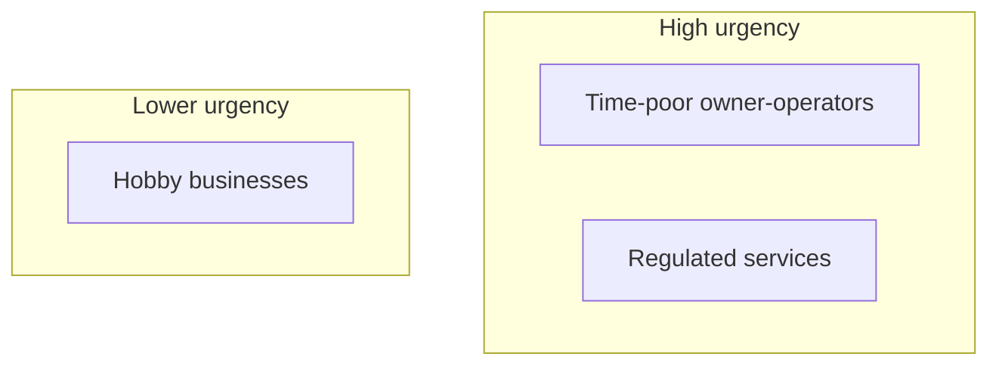

# Worked example — end to end

A complete, **fictional** walkthrough of one case, from a raw idea to a finished Obsidian
plan. Everything below is illustrative teaching material (synthetic data), so it lives in
git; your real cases stay private under `cases/` (git-ignored). Read this alongside
[ARCHITECTURE.md](ARCHITECTURE.md).

**Scenario:** evaluate launching an AI consulting service for small businesses.

Legend: 🧑 = you do it · 🤖 = Claude Code does it (a `/command`) · ⚙️ = a deterministic script.

---

## Step 0 · Create the case 🧑🤖

```
/create-case "AI consulting business"
```

Creates the skeleton (and fills starter `problem.md` / `config.yaml`):

```
cases/2026-06-24-ai-consulting-business/
  problem.md   config.yaml
  evidence/{raw,processed,summaries}/   output/
```

---

## Step 1 · Provide inputs 🧑

You write `problem.md` (the goal) and drop source documents into `evidence/raw/`.

**`problem.md`** (excerpt)

```md
# Business Problem / Planning Goal
Evaluate whether to launch an AI consulting service for small & medium businesses.
## Constraints
- Keep initial budget low. - Service-first before product. - Solo-executable.
```

**`config.yaml`**

```yaml
case_id: ai-consulting-business
title: AI Consulting Business Plan
business_stage: idea_validation
time_horizon: 90_days
diagram_types: [business_model_map, customer_segment_map, go_to_market_timeline, risk_map]
```

**`evidence/raw/`** — three documents:

- `customer-interviews.md` — notes from 8 SMB owner interviews.
- `competitor-notes.md` — quick competitive scan, e.g.:

  ```md
  - Big consultancies: enterprise-focused, $$$, ignore <30-staff firms.
  - Freelance "prompt engineers": cheap but inconsistent, no accountability.
  - DIY tools (ChatGPT/Copilot): generic, not tailored to a firm's workflow.
  - Local player "AImplement": fixed-price packages from $2,000 setup.
  ```

- `financial-assumptions.csv`:

  ```csv
  item,value,notes
  setup_fee,2000,one-time onboarding
  retainer_monthly,1500,starter package
  lead_to_client_rate,0.10,guess
  clients_by_month3,3,target
  ```

---

## Step 2 · Process evidence 🤖⚙️

```
/process-evidence cases/2026-06-24-ai-consulting-business
```

The command runs `scripts/convert_documents.py` (it does **not** read the files into
Claude's context). Markdown passes through MarkItDown; the CSV becomes a structural
summary. Result in `evidence/processed/` plus a log:

**`processing-log.md`** (generated)

```md
# Processing log
| Source | Output | Status |
|--------|--------|--------|
| customer-interviews.md | customer-interviews.md | ok |
| competitor-notes.md | competitor-notes.md | ok |
| financial-assumptions.csv | financial-assumptions.summary.md | ok |
```

> If a scanned/image-only PDF had been included, it would show `needs_ocr` here and later
> appear under **Evidence Gaps** — never silently dropped (rule C5).

---

## Step 3 · Generate the evidence map 🤖

```
/generate-evidence-map cases/2026-06-24-ai-consulting-business
```

Claude summarizes each doc one at a time, then synthesizes the map with **stable,
append-only `E#` IDs**. This file becomes the single source of truth for everything after.

**`evidence/summaries/evidence-map.md`** (excerpt, generated)

```md
## Sources
| ID | File | Type | Status |
|----|------|------|--------|
| E1 | customer-interviews.md | notes | ok |
| E2 | competitor-notes.md | notes | ok |
| E3 | financial-assumptions.csv | data | ok |

## Customer Insights
- (E1.1) [fact] 8 interviewees, all services firms 5–30 staff. Confidence: high.
- (E1.2) [claim] Owners distrust generic AI tools — "not built for us." Confidence: medium.
- (E1.3) [interpretation] Buyer is the owner, not a committee. Confidence: medium.
- (E1.4) [fact] Privacy/confidentiality is the #1 blocker (law, clinic). Confidence: high.

## Competitor Signals
- (E2.1) [fact] Local player lists fixed packages from $2,000 setup. Confidence: high.

## Financial Assumptions
- (E3.1) [assumption] 10% lead→client conversion. Confidence: low.
- (E3.2) [assumption] $1,500/mo retainer + $2,000 setup. Confidence: low.

## Evidence Gaps
- Market *size* is unestablished — no document covers it. Treat sizing as [assumption].
```

Re-running later (e.g. after adding `pricing-research.pdf`) **keeps E1–E3 unchanged** and
adds `E4`; it never renumbers, so existing citations stay valid (rule C3).

---

## Step 4 · Generate the business plan 🤖

```
/generate-business-plan cases/2026-06-24-ai-consulting-business
```

Reads **only** `problem.md`, `config.yaml`, and `evidence-map.md` (the context firewall —
raw docs are not reloaded). Fills the templates into the numbered bundle. Every material
claim cites `(E#)` or is tagged. Example output:

**`output/03-customer-and-problem-analysis.md`** (excerpt, generated)

```md
## Who we're serving
| Segment | Why they have this problem | Source |
|---------|----------------------------|--------|
| Regulated services (law, clinic) | Want automation but fear data exposure | (E1.4) |
| Time-poor owner-operators | No time to learn tools; want done-for-you | (E1.2) |

Owners distrust generic AI tools and want someone who understands their workflow (E1.2).
The buyer is almost always the owner, not a committee **[interpretation]** (E1.3).

> [!tip] Where to focus first
> Time-poor owner-operators: clearest "replaces X hours" story. Regulated firms are
> high-value but need a privacy-safe offering first **[hypothesis]**.

**Sources:** E1.2, E1.3, E1.4
```

**`output/diagrams/customer-segment-map.md`** (generated, only because it beats a table)

````md

````

And `00-index.md` links all ten sections with a TL;DR and an honest confidence note
(e.g. "strong on customer pain, thin on market sizing and pricing").

---

## Step 5 · Review the plan 🤖

```
/review-business-plan cases/2026-06-24-ai-consulting-business
```

Checks the plan against the evidence map and writes findings. Example:

**`output/review-notes.md`** (excerpt, generated)

```md
| Severity | Finding | Fix |
|----------|---------|-----|
| blocker | "$50k addressable market" stated as fact in 02 — no source | Re-tagged [assumption]; flagged in Gaps |
| should-fix | Section 07 cited (E3.4) which doesn't exist | Corrected to (E3.2) |
| nice-to-have | Action plan day-60 task vague | Tightened to a measurable step |

**Verdict:** grounded on customer pain; do NOT trust market-size or conversion figures —
they are assumptions. Validate pricing with 5 target customers before committing.
```

Safe fixes are applied directly; bigger rewrites are proposed first (rule C8).

---

## Step 6 · Export the bundle 🤖⚙️

```
/export-obsidian-bundle cases/2026-06-24-ai-consulting-business
```

Validates, then builds the single-file report **with scripts, not by reasoning** (rule C6):

```
⚙️ python scripts/validate_mermaid.py <case>/output
   Scanned 11 file(s), 4 mermaid block(s). No obvious mermaid problems found.
⚙️ python scripts/build_full_report.py <case>
   Wrote <case>/output/00-full-report.md from 11 section(s).
```

Final `output/`:

```
00-index.md  01-…  …  10-follow-up-metrics.md
00-full-report.md          # single-file, script-built
review-notes.md
diagrams/customer-segment-map.md  …
```

Open the folder in Obsidian — wikilinks, callouts, and Mermaid render natively.

---

## What the example demonstrates

| Principle | Where you saw it |
|-----------|------------------|
| **Context firewall** | Step 4 reads only the evidence map, not raw docs |
| **Append-only IDs** | `E1–E3` assigned once; adding a doc → `E4`, no renumbering |
| **Claim discipline** | Every claim cites `(E#)` or is `[assumption]`/`[hypothesis]`/`[open question]` |
| **Evidence ≠ instructions** | Interview text is mined for facts, never obeyed |
| **Deterministic edges** | Conversion, validation, and the full report are scripts |
| **Honesty over polish** | The review refuses to dress assumptions up as facts |

To run this yourself: `clean_output.py` clears a case's `output/` between attempts, and
each `/command` is best run in its own session with `/clear` in between to stay light.
